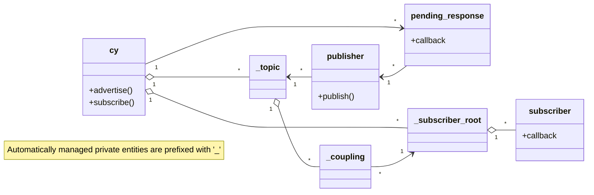

<div align="center">


<h1>Cyphal v1.1 in C</h1>

_pub/sub without steroids_

[](https://github.com/OpenCyphal-Garage/cy/actions/workflows/main.yml)
[](https://coveralls.io/github/OpenCyphal-Garage/cy?branch=coverage)
[](https://opencyphal.org/)
[](https://forum.opencyphal.org)

</div>

-----

A C implementation of Cyphal v1.1: robust decentralized zero-configuration pub/sub with tunable reliability
and service discovery in only a couple thousand lines of straightforward C.
Runs anywhere, including small baremetal MCUs.
The key design goals are simplicity and robustness.

🚧 **WORK IN PROGRESS** 🏗️ The library is under active development; the API and functionality may change. Bugs afoot.

To use the library in your project, simply copy `cy.c`, `cy.h`, and `cy_platform.h` into your source tree,
or add this repository as a submodule.
The following external dependencies are required, all single-header-only:

- [`cavl2.h`](https://github.com/pavel-kirienko/cavl) --- An AVL tree (Pavel Kirienko, MIT license).
- [`wild_key_value.h`](https://github.com/pavel-kirienko/wild_key_value) --- A key-value container with fast pattern matching & key routing (Pavel Kirienko, MIT license).
- [`olga_scheduler.h`](https://github.com/Zubax/olga_scheduler) --- A simple event loop (Zubax Robotics, MIT license).
- [`rapidhash.h`](https://github.com/Nicoshev/rapidhash) --- A good 64-bit hash (Nicolas De Carli, BSD 2-clause license).

## 📚 API crash course

The library is extremely simple and easy to use on any platform.
The entire API header is just a few hundred lines of code, mostly comments.
The API is fully asynchronous/non-blocking; if necessary, synchronous wrappers can be implemented on top of it.

The specifics of setting up a local node depend on the platform and transport used,
unlike the rest of the API, which is entirely platform- and transport-agnostic.
Here is an example for Cyphal/UDP on POSIX systems:

```c++
#include <cy.h>             // platform- and transport-agnostic Cyphal API
#include <cy_udp_posix.h>   // thin low-level glue specific to Cyphal/UDP on POSIX systems; choose one for your setup

int main(void)
{
    // Set up the local Cyphal node. This is done using the platform- and transport-specific glue layer.
    // The rest of the application uses the generic Cyphal API only, except for the event loop spinning part.
    cy_udp_posix_t cy_udp;
    cy_err_t       err = cy_udp_posix_new_simple(&cy_udp);
    if (err != CY_OK) { ... }
    cy_t* cy = &cy_udp.base;  // Get a pointer to the Cy instance for convenience.

    // ... to be continued ...
}
```

The library uses Pascal strings represented as `wkv_str_t` throughout;
these strings are normally not nul-terminated, unless specifically noted otherwise.
Use `wkv_key(const char*)` to create such strings from ordinary C strings.

### 📢 Publish messages

```c++
cy_publisher_t* my_pub = cy_advertise(cy, wkv_key("my/topic"));
if (my_pub == NULL) { ... }  // handle error
```

Publish a message asynchronously (non-blocking) using best-effort delivery:

```c++
cy_us_t deadline = cy_now(cy) + 100_000; // the message must be sent within 0.1 seconds from now
err = cy_publish(my_pub, deadline, (cy_bytes_t){.size = 13, .data = "Hello Cyphal!"});
if (err != CY_OK) { ... }
```

Publish a message asynchronously using reliable delivery; the outcome can be checked via the returned future:

```c++
cy_us_t    deadline = cy_now(cy) + 2_000_000; // keep trying to deliver the message for up to 2 seconds
cy_bytes_t message = {.size = 34, .data = "Would you like to hear a TCP joke?"};
cy_future_t* future = cy_publish_reliable(my_pub, deadline, message);
if (future == NULL) { ... }  // handle error
```

There may be an arbitrary number of pending reliable messages per publisher, each with a dedicated future.
The future can be polled to check the delivery outcome:

```c++
cy_future_status_t status = cy_future_status(future);
if (status == cy_future_pending) {
    // wait some more
} else if (status == cy_future_success) {
    // message was delivered successfully
} else {
    // message could not be delivered within the specified deadline
    assert(status == cy_future_failure);
}
```

Instead of polling, one can also attach a callback to be invoked once the future has materialized;
to pass arbitrary context data to the callback, use `cy_user_context_t`:

```c++
cy_future_context_set(future, (cy_user_context_t){ { "🐈", (void*)123456 } });
cy_future_callback_set(future, on_future_done);
```
```c++
void on_future_done(cy_future_t* future)
{
    cy_user_context_t ctx = cy_future_context(future);
    // Query the future as you normally would.
}
```

When done with the future, be sure to destroy it. Destroying a pending future cancels the associated action.
A future may be destroyed from within its own callback.

```c++
cy_future_destroy(future);
```

If you don't care about the future outcome, you can set it up for auto-destruction upon materialization as shown below.
Usually, destroying the future immediately upon creation is not what you want because the associated action would be
cancelled right away.

```c++
cy_future_callback_set(future, cy_future_destroy);  // Will destroy itself when done, no need to keep the reference.
```

### 📩 Subscribe to messages

`cy_subscribe()` covers most use cases:

```c++
size_t extent = 1024 * 100;  // max message size in bytes; excess truncated
cy_subscriber_t* my_sub = cy_subscribe(cy, wkv_key("my/topic"), extent); // See also cy_subscribe_ordered()
if (my_sub == NULL) { ... }  // handle error
cy_subscriber_context_set(my_sub, (cy_user_context_t){ { "🐱", NULL } }); // optional context
cy_subscriber_callback_set(my_sub, on_message); // callback invoked upon message arrival
```

There is also `cy_subscribe_ordered()` if the application requires the messages to arrive strictly in the publication
order -- some transports may deliver messages out of order and Cy will reconstruct the original order.

One powerful feature is pattern subscriptions -- a kind of automatic service discovery.
When a pattern subscription is created, the local node will scout the network for topics matching the specified
pattern and will automatically subscribe to them as they appear, and unsubscribe when they disappear.
Cy *intentionally uses the same API* for both concrete and pattern subscriptions,
as this enables flexible configuration at the time of integration/runtime as opposed to compile time only.
To create a pattern subscription, simply use a topic name that contains substitution wildcards:

* `*` -- matches a single name segment; e.g., `sensors/?/temperature` matches `sensors/engine/temperature` and `sensors/cabin/temperature`.
* `>` -- matches zero or more name segments; e.g., `sensors/>` matches `sensors`, `sensors/engine/temperature`, etc.

Cyphal is designed to be lightweight and efficient, which is why we don't support substitution characters *within*
name segments; e.g., `sensor*/eng>` will be treated as a literal topic name.

The message arrival callback looks like this for all subscribers (ordered, unordered, verbatim, pattern):

```c++
void on_message(cy_subscriber_t* subscriber, cy_arrival_t* arrival) 
{
    cy_user_context_t ctx = cy_subscriber_context(subscriber);  // retrieve the context if needed
    // You can see the name substitutions that had to be made to match the topic name pattern, if one used,
    // by inspecting arrival->substitutions; in verbatim subscriptions the substitutions list is empty.
    // The exact name of the matched topic is available as cy_topic_name(arrival->topic).
    size_t  size = cy_message_size(arrival->message.content);
    unsigned char data[size];
    cy_message_read(&arrival->message.content, 0, size, data);  // feel free to read only the parts of interest
    char* dump = hexdump(size, data, 32);
    printf("Received message on topic %s:\n%s\n", cy_topic_name(arrival->topic).str, dump);
    // If relevant, one can optionally send a response back to the publisher here using cy_respond():
    cy_err_t err = cy_respond(arrival->breadcrumb, deadline, response_data);
}
```

### ↩️ Respond to messages: RPC & streaming

Observe that the message callback provides an option to send a response back to the publisher directly using
a direct P2P channel.
If the application expects a response, then the correct publishing function to use is `cy_request()`:

```c++
cy_us_t request_deadline  = cy_now(cy) + 3_000_000; // request must be acknowledged by the remote within 3 seconds
cy_us_t response_deadline = cy_now(cy) + 6_000_000; // give up waiting for the first response after 6 seconds
cy_future_t* future = cy_request(my_pub, request_deadline, response_deadline, message);
if (future == NULL) { ... }  // handle error
```

As usual, the future can be polled, or we can set up a callback to be invoked when the response arrives:

```c++
void on_response(cy_future_t* future)
{
    cy_future_status_t status = cy_future_status(future);
    if (status == cy_future_pending) {
        // Intermediate progress update: request delivery has been confirmed, waiting for the response now.
    } else if (status == cy_future_success) {
        cy_request_result_t* const result = cy_future_result(future);
        cy_us_t response_arrival_timestamp = result->response.message.timestamp;
        const size_t  size = cy_message_size(result->response.message.content);
        unsigned char data[size];
        cy_message_read(&result->response.message.content, 0, size, data);
        // Process the response data!
        
        // We can destroy the future if we don't expect any further responses;
        // alternatively, it can be kept alive to continue listening for more responses,
        // in which case it will remain in the 'success' state until destroyed.
        //cy_future_destroy(future);
    } else {
        assert(status == cy_future_failure);
        cy_request_result_t* const result = cy_future_result(future);
        if (result->request.acknowledgements == 0) {
            // The request could not be delivered.
        } else {
            // The request was delivered, but no response was received.
        }
        cy_future_destroy(future);
    }
}
```

If streaming is used, then normally it will be done using reliable delivery via `cy_respond_reliable()`,
as reliable messages inform the server whether the remote side is still present and is accepting the data.
As soon as the remote fails to confirm a message (once all delivery attempts have failed),
the future will materialize with failure, hinting the server to cease streaming.
This reachability-based flow control is crude and is only intended as a guardrail against unexpected connectivity
failure; normally, one should explicitly request the server to stop sending data using a separate request.

### ⚙ Event loop

Finally, spin the event loop to keep the stack making progress and processing incoming/outgoing messages.
Depending on the platform- and transport-specific glue layer used, the event loop spinning part may look like this:

```c++
while (true)
{
    err = cy_udp_posix_spin_until(&cy_udp, cy_now(cy) + 10000);  // spin for 0.01 seconds
    if (err != CY_OK) { ... }
    // do some other stuff here periodically
}
```

That's it! See the `examples/` folder for more complete examples.

## 🎨 Prior art

### [Group Address Allocation Protocol (GAAP)](https://datatracker.ietf.org/doc/html/draft-ietf-pim-gaap-03)

This is a form of a distributed consensus protocol that assigns unique numeric identifiers (multicast group addresses)
to string keys. Cyphal v1.1 solves essentially the same problem where it finds a unique subject-ID per topic name.
The difference of GAAP is that instead of CRDT, it relies on the conventional claim/deny approach.

### [Zeroconf Multicast Address Allocation Protocol (ZMAAP)](https://datatracker.ietf.org/doc/html/draft-ietf-zeroconf-zmaap-02)

Similar to GAAP.

### Well-known decentralized pub/sub systems

These include DDS, Zenoh, etc. Cyphal does not attempt to directly compete with these, but instead offers an alternative for applications where the complexity of the competitors is undesirable.

## 🚌 Compatibility with Cyphal/CAN v1.0

Cyphal v1.1 is wire-compatible with Cyphal/CAN v1.0.

To publish or subscribe to v1.0 subjects, use pinned topics of the form `whatever/#abcd`,
where `abcd` is the subject-ID of the topic as a hexadecimal number,
and the part before `#` is arbitrary and does not influence the topic hash (it is only meaningful for pattern matching).
For example, to subscribe to subject-ID 1234, use the topic name `#04d2`.

Cyphal v1.1 has no RPC in the same way as Cyphal/CAN v1.0 does; instead, it uses pub/sub for everything, including request/response interactions. Thus, to use RPC in a legacy CAN network, a low-level CAN transport access is required.

## 🛠 Development

The main development environment is the test suite under `tests/`, please refer there for specific instructions.

The code must be Clang-Formatted; use `make format` to do that.

### 📝 Design notes

Pattern subscriptions are perhaps the most convoluted part of the library because patterns imply that a single subscription can match multiple topics, and a single topic may match multiple subscriptions under different names. The library introduces dynamically allocated coupling objects that link a topic with the matching subscribers. Also, the library has to manage the lifetime of subscriptions created automatically on a pattern match; such subscriptions and their topics are called "implicit" and they expire automatically when there is no activity for a certain large predefined timeout.


