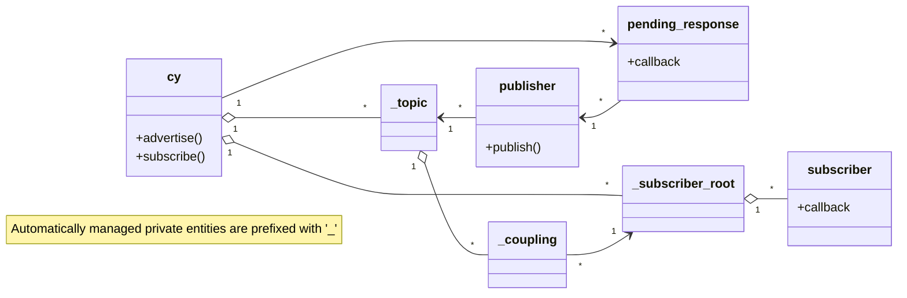

# Cyphal v1.1 in C

A C implementation of Cyphal v1.1: robust decentralized zero-configuration pub/sub with tunable reliability and service discovery in only a couple thousand lines of straightforward C. Runs anywhere, including small baremetal MCUs. The key design goals are simplicity and robustness.

Build-time dependencies, all single-header-only:

- [`cavl2.h`](https://github.com/pavel-kirienko/cavl) -- AVL tree.
- [`wkv.h`](https://github.com/pavel-kirienko/wild_key_value) -- key-value container with fast pattern matching & key routing.
- [`rapidhash.h`](https://github.com/Nicoshev/rapidhash) -- a good 64-bit hash by Nicolas De Carli (BSD 2-clause license).

## API crash course

The library is extremely simple and easy to use on any platform.
The entire API header is just a few hundred lines of code, mostly comments.

The specifics of setting up a local node depend on the platform and transport used,
unlike the rest of the API, which is entirely platform- and transport-agnostic.
Here is an example for Cyphal/UDP on POSIX systems:

```c++
#include <cy.h>             // platform- and transport-agnostic Cyphal API
#include <cy_udp_posix.h>   // thin low-level glue specific to Cyphal/UDP on POSIX systems; choose one for your setup

int main(void)
{
    // Set up the local Cyphal node. This is done using the platform- and transport-specific glue layer.
    // The rest of the application uses the generic Cyphal API only, except for the event loop spinning part.
    cy_udp_posix_t cy_udp;
    cy_err_t       res = cy_udp_posix_new_simple(&cy_udp);
    if (res != CY_OK) { ... }
    cy_t* const cy = &cy_udp.base;  // Get a pointer to the Cy instance for convenience.

    // ... to be continued ...
}
```

Create a publisher:

```c++
cy_publisher_t* const my_pub = cy_advertise(cy, wkv_key("my/topic"));
if (my_pub == NULL) { ... }  // handle error
```

Publish a message asynchronously (non-blocking) using best-effort delivery:

```c++
res = cy_publish(my_pub,
                 cy_now(cy) + 100_000, // the message must be sent within 0.1 seconds from now
                 (cy_bytes_t){.size = 13, .data = "Hello Cyphal!"});
if (res != CY_OK) { ... }
```

Publish a message asynchronously (non-blocking) using reliable delivery (with delivery confirmation);
the result can be provided per message via a callback:

```c++
res = cy_publish_reliable(my_pub,
                          cy_now(cy) + 2_000_000,   // keep trying to deliver the message for up to 2 seconds
                          (cy_bytes_t){.size = 34, .data = "Would you like to hear a TCP joke?"},
                          CY_USER_CONTEXT_EMPTY,    // here you can pass arbitrary context data to the callback
                          NULL);                    // pass a callback here to get notified of the delivery outcome
if (res != CY_OK) { ... }
```

Subscribe to a topic:

```c++
cy_subscriber_t* const my_sub = cy_subscribe(cy,
                                             wkv_key("my/topic"),
                                             1024 * 100,            // max message size in bytes; excess truncated
                                             CY_USER_CONTEXT_EMPTY, // context data passed to the callback
                                             on_message);           // callback invoked upon message arrival
if (my_sub == NULL) { ... }
```

The message arrival callback looks like this:

```c++
static void on_message(cy_user_context_t user_context, cy_arrival_t* const arrival) 
{
    const size_t  size = cy_message_size(arrival->message.content);
    unsigned char data[size];
    cy_message_read(&arrival->message.content, 0, size, data);  // feel free to read only the parts of interest
    char* const dump = hexdump(size, data, 32);
    printf("Received message on topic %s:\n%s\n", arrival->topic->name, dump);
    // If relevant, you can optionally send a response back to the publisher here using cy_respond():
    // res = cy_respond(arrival->responder, deadline, response_data, ...);
    // It is also possible to store the responder instance to send the response at any time later.
}
```

Depending on the platform- and transport-specific glue layer used, the event loop spinning part may look like this:

```c++
while (true)
{
    res = cy_udp_posix_spin_until(cy, cy_now(cy) + 10000);  // spin for 0.01 seconds
    if (res != CY_OK) { ... }
    // here you can do other stuff periodically
}
```

That's it! See the `examples/` folder for more complete examples.

## Prior art

### [Group Address Allocation Protocol (GAAP)](https://datatracker.ietf.org/doc/html/draft-ietf-pim-gaap-03)

Instead of CRDT, the GAAP relies on the conventional claim/deny approach. Otherwise, the protocol is very similar in 
spirit.

### [Zeroconf Multicast Address Allocation Protocol (ZMAAP)](https://datatracker.ietf.org/doc/html/draft-ietf-zeroconf-zmaap-02)

Similar to GAAP.

### Well-known pub/sub systems

The list is long: DDS, MQTT, Zenoh, ROS1, etc. The distinguishing feature of Cyphal is that it is extremely simple and lightweight (only a couple thousand SLoC) while providing the key building blocks for decentralized pub/sub.

## Compatibility with Cyphal/CAN v1.0

Cyphal v1.1 is wire-compatible with Cyphal/CAN v1.0.

To publish or subscribe to v1.0 subjects, use pinned topics of the form `/#abcd`, where `abcd` is the subject-ID of the topic as a 4-digit hexadecimal number. For example, to subscribe to subject-ID 1234, use the topic name `/#04d2`.

Cyphal v1.1 has no RPC in the same way as Cyphal/CAN v1.0 does; instead, it uses pub/sub for everything, including request/response interactions. Thus, to use RPC in a legacy CAN network, a low-level CAN transport access is required.

## Design notes


