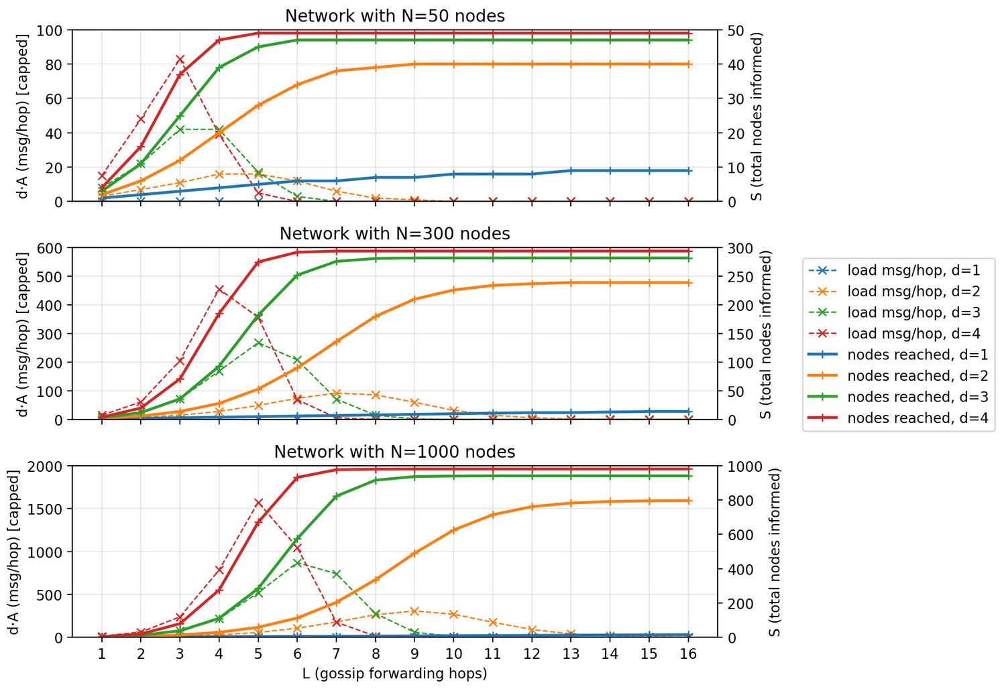
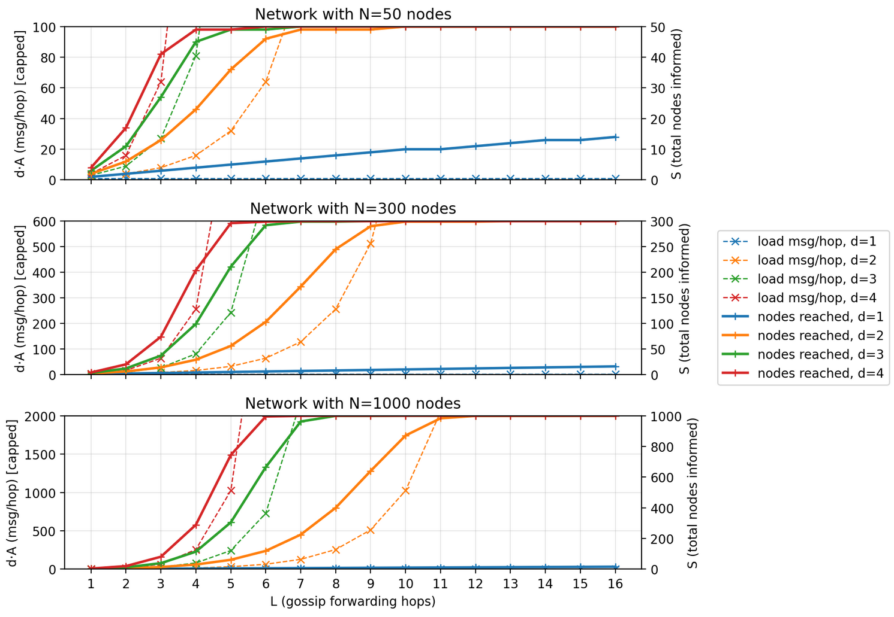

# Model-based verification and specification

Various models used to predict and prove protocol behaviors are stored here.
They are the basis for important protocol design decisions.

## Epidemic gossip propagation models

Each node carries a short (ca. couple dozen) list of most recently seen gossip messages, where each gossip is identified by its contents (topic hash, eviction counter, lage), where the unique gossip identifier can be conveniently hashed down to a 64-bit integer by means of simple xors and bit shifts. This gossip deduplication cache is important for network load regulation; the analytical models are available in `gossip_propagation.ipynb`. While the cache slightly reduces the reach of each gossip message under random peer selection (since propagation ceases once the message is accidentally routed back to a peer that has already seen it), this is an acceptable cost of the significant reduction of the peak network load.

The network load and reach were evaluated for different gossip TTL (forward count) and outdegree (forward targets per hop) for representative network sizes.

With dedup cache enabled and without it; notice the network load and propagation rate trade-offs (note: TTL=x as defined in the protocol corresponds to x+1 gossip forwarding hops):

<table>
  <tr>
    <td width="49%">
      
    </td>
    <td width="49%">
      
    </td>
  </tr>
</table>

Using N=300 as a representative network size to tune the stack parameters for, we choose the following parameters:

- for urgent gossips on consensus repair: TTL 10 (11 hops), forwarding outdegree d=2
- for periodic background gossips: TTL 1 (2 hops: original plus one forward), forwarding outdegree d=2

The size of the dedup cache should approximate the maximum number of concurrent gossips in flight; nodes do not have to agree on a particular number since it does not affect wire compatibility but rather caps the peak gossip traffic. More resource-rich nodes may implement larger dedup caches while smaller (MCU-powered) nodes may carry much smaller caches (at least 1 entry is better than nothing); this naturally delegates the load regulation to the more powerful nodes without the need to actively synchronize node roles. Storing the cache in a simple linear array in memory means that capacities above ~16 might be unreasonable because at that point linear lookup becomes inefficient, calling for more sophisticated containers.
