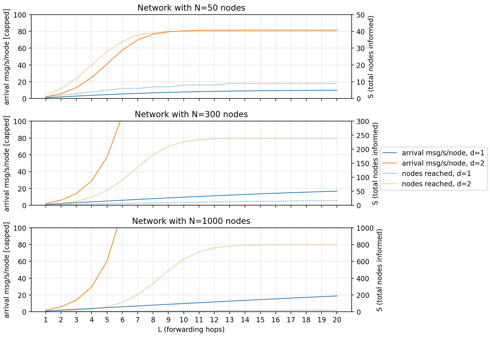

# Model-based verification and specification

Various models used to predict and prove protocol behaviors are stored here.
They are the basis for important protocol design decisions.

## Epidemic gossip propagation models and protocol parameter derivation

These are conclusions based on the analytical models in `gossip_propagation.ipynb`.

Each node maintains a short set of most recently seen gossip messages, where each gossip is identified by its contents (topic hash, eviction counter, log-age). This gossip deduplication cache is important for network load regulation as illustrated below. While the cache slightly reduces the reach of each gossip message under random peer selection (since propagation ceases once the message is routed back to a peer that has already seen it), this is an acceptable cost of the significant reduction of the peak network load.

The network load and reach were evaluated for different gossip TTL and outdegree (forward targets per hop) for representative network sizes. The plots below summarize the results with the dedup cache and without it; notice the network load and propagation rate trade-offs (note: TTL=x as conventionally defined corresponds to L=x+1 hops):

<table>
  <tr>
    <td width="49%">
      
    </td>
    <td width="49%">
      
    </td>
  </tr>
</table>

Using N=300 as a representative network size to tune the stack parameters for, for urgent gossips (that are initiated only when consensus repair is needed and never during normal operation) the chosen parameters are:

- urgent gossip TTL 10 ($L_\text{urgent}=11$ hops);
- urgent gossip outdegree d=2.

The capacity of the dedup cache scales with the maximum number of concurrent gossips in flight; nodes do not have to agree on a particular number since it does not affect interoperability but rather caps the peak gossip traffic. Resource-rich nodes may and should implement larger caches. Storing the cache in a simple linear array in memory means that capacities above ~16 might be less desirable in small nodes because at that point linear lookup becomes inefficient, calling for more sophisticated containers.

Periodic background gossips are messages that are sent out on a fixed schedule to provide self-healing, even if no repair is needed. These are sent in two modes:

- **Broadcast gossips** that are received by every node. These scale poorly for obvious reasons, hence the background gossips are sent at a very low rate ca. $r_\text{broadcast}$=1/3..1/10 Hz. The arrival load per node is $(N-1) \cdot r_\text{broadcast}$. These are used for node (peer) discovery and to provide a worst-case convergence upper bound, since this propagation method is deterministic while epidemic gossips are probabilistic. Various ad-hoc optimizations are possible without compromising protocol correctness, such as temporarily increasing the broadcast rate shortly after boot, or switching between high and low rate depending on the size of the network or the arrival rate, etc.

- **Unicast epidemic gossips** sent to random peers at much higher rates. The essential requirement for these is good scalability with network size: the average transmit/arrival load per node should stay constant or at worst be logarithmic in network size, otherwise small MCU nodes will not be possible to integrate into large networks.

The model predicts that the periodic gossip outdegree should be d=1, as d=2 leads to linear arrival load with N (at large TTL), and higher d values grow the load even faster. The following visualization assumes unicast gossip transmission rate of 1 Hz, and that deduplication cache is used and is perfect; imperfection in the deduplication cache improves propagation and increases the load at small N but the effect of the imperfection diminishes with network size, especially at d=1, so accurate modeling of the cache is omitted.

At d=1, the arrival load scales approximately linearly with the product of TTL and transmission rate r, and is invariant over the network size, which is what we want because we control the TTL and the rate but not N.

We prefer the gossip arrival load to be small to keep the protocol efficient. Trading off the unicast gossip transmission rate $r_\text{unicast}$ for higher TTL ($L_\text{unicast}-1$) is believed to be a sensible choice because higher TTL values provide better gossip distribution than higher origination rates given the same total arrival load (refer to Monte-Carlo). Using the gossip origination rate of 1 Hz (derived from Cyphal v1.0's heartbeat), we have that the gossip hop count (TTL+1) equals the average unicast arrival rate per node. The total arrival load per node $A$ (msg/s) in a converged network is approximated as (assuming N>>TTL):

$$
r_\text{arrival} = (N-1) \cdot r_\text{broadcast} + L_\text{unicast} \cdot r_\text{unicast}
$$

It is obviously not essential that all nodes agree on these parameters. A sensible default that should suit most applications, but can still be tweaked ad-hoc if necessary without risking compatibility issues, is:

- periodic unicast gossip TTL 1 ($L_\text{unicast}=2$ hops, adjustable);
- periodic unicast gossip outdegree d=1 (constant, not adjustable);
- broadcast gossip rate approx. 1/5 Hz, or perhaps automatically adjustable between approx. 1/3 and 1/10 Hz depending on network size, uptime, and other heuristics.

A sensible gossip scheduling approach is to count the total number of gossips published per node, send out a gossip every 1±0.125 s, and make every $n$-th gossip broadcast, with n being somewhere around 5 (may be automatically runtime-adjustable between 3..10 depending on network size and/or gossip arrival load). However, to speed up initial convergence and/or partition repair, $n$ may become 1 if the epidemic peer set has at least one empty or stale entry. The last condition implies that very small networks will only use broadcast gossips, which is fine.
